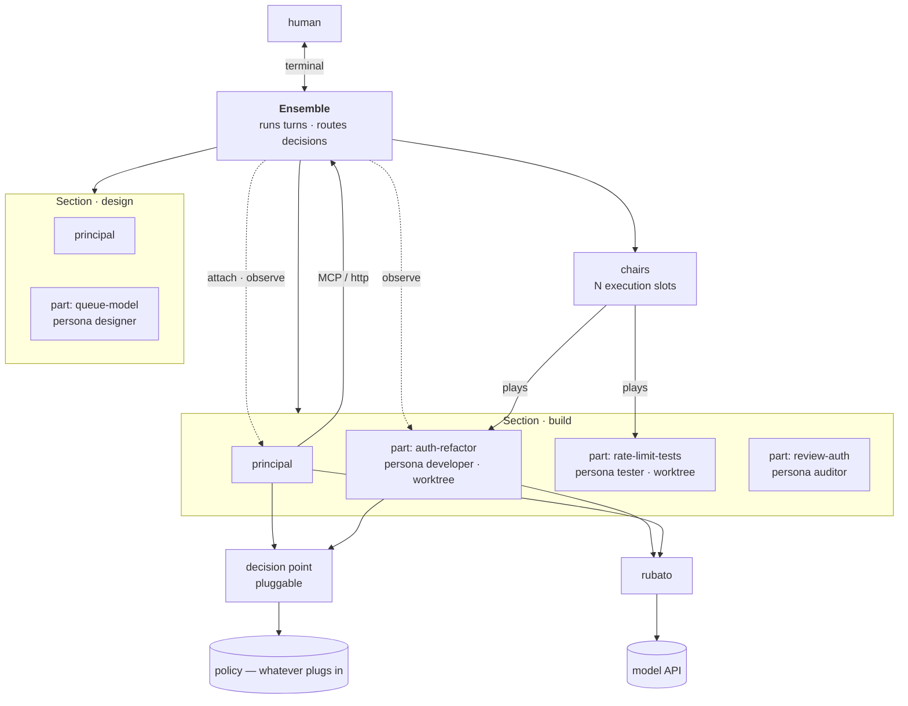

# Architecture

Sections, their parts, the chairs that play them, and where decisions and model
traffic go. Companion to [README §2](../README.md#2-architecture).

```mermaid
flowchart TB
  H["human"]
  ENS["<b>Ensemble</b><br/>runs turns · routes decisions"]

  subgraph S1["Section · build"]
    P1["principal"]
    A1["part: auth-refactor<br/>persona developer · worktree"]
    A2["part: rate-limit-tests<br/>persona tester · worktree"]
    A3["part: review-auth<br/>persona auditor"]
  end

  subgraph S2["Section · design"]
    P2["principal"]
    D1["part: queue-model<br/>persona designer"]
  end

  CH["chairs<br/>N execution slots"]
  DEC["decision point<br/>pluggable"]
  POL[("policy — whatever plugs in")]
  RUB["rubato"]
  API[("model API")]

  H <-->|"terminal"| ENS
  ENS -.->|"attach · observe"| P1
  ENS -.->|"observe"| A1
  ENS --> S1
  ENS --> S2
  ENS --> CH
  CH -->|"plays"| A1
  CH -->|"plays"| A2
  P1 -->|"MCP / http"| ENS
  P1 --> DEC
  A1 --> DEC
  DEC --> POL
  A1 --> RUB
  P1 --> RUB
  RUB --> API
```
