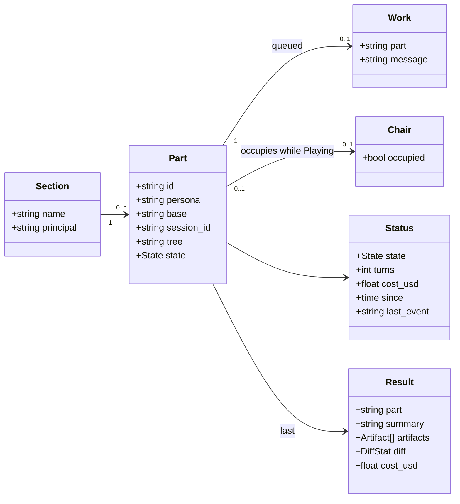

# Contract types

What Ensemble holds. Companion to [README §4](../README.md#4-functional-contract).

```mermaid
classDiagram
  direction LR
  class Part {
    +string id
    +string persona
    +string base
    +string session_id
    +string tree
    +State state
  }
  class Chair {
    +bool occupied
  }
  class Work {
    +string part
    +string message
  }
  class Status {
    +State state
    +int turns
    +float cost_usd
    +time since
    +string last_event
  }
  class Result {
    +string part
    +string summary
    +Artifact[] artifacts
    +DiffStat diff
    +float cost_usd
  }
  class Section {
    +string name
    +string principal
  }
  Section "1" --> "0..n" Part
  Part "1" --> "0..1" Work : queued
  Part "0..1" --> "0..1" Chair : occupies while Playing
  Part --> Status
  Part --> Result : last
```
