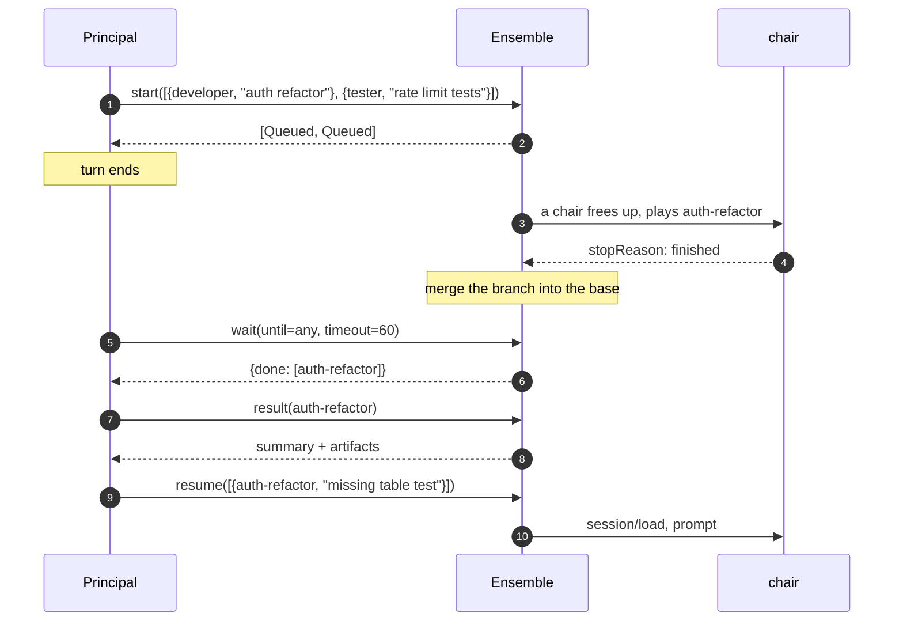

# Dispatch

A principal starting work, collecting a result, and resuming a part.
Companion to [README §4](../README.md#4-flows).

```mermaid
sequenceDiagram
  autonumber
  participant O as Principal
  participant E as Ensemble
  participant C as chair
  O->>E: start([{developer, "auth refactor"}, {tester, "rate limit tests"}])
  E-->>O: [Queued, Queued]
  Note over O: turn ends
  E->>C: a chair frees up, plays auth-refactor
  C-->>E: stopReason: finished
  Note over E: merge the branch into the base
  O->>E: wait(until=any, timeout=60)
  E-->>O: {done: [auth-refactor]}
  O->>E: result(auth-refactor)
  E-->>O: summary + artifacts
  O->>E: resume([{auth-refactor, "missing table test"}])
  E->>C: session/load, prompt
```
