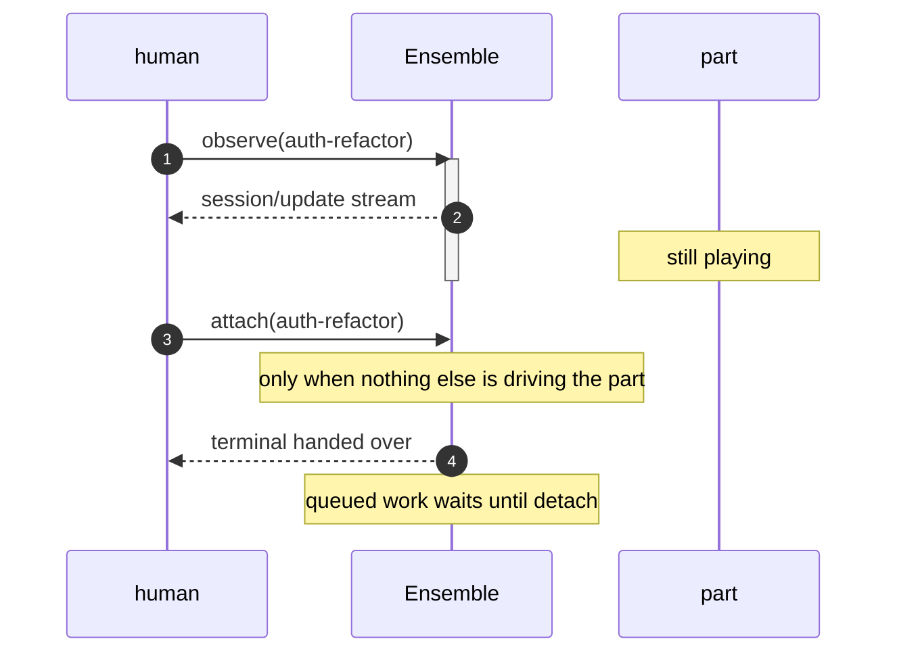

# Observing and attaching

Observing takes nothing from a running part; attaching takes ownership.
Companion to [README §4](../README.md#4-flows).

```mermaid
sequenceDiagram
  autonumber
  participant H as human
  participant E as Ensemble
  participant P as part
  H->>E: observe(auth-refactor)
  activate E
  E-->>H: session/update stream
  Note over P: still playing
  deactivate E
  H->>E: attach(auth-refactor)
  Note over E: only when nothing else is driving the part
  E-->>H: terminal handed over
  Note over E: queued work waits until detach
```
