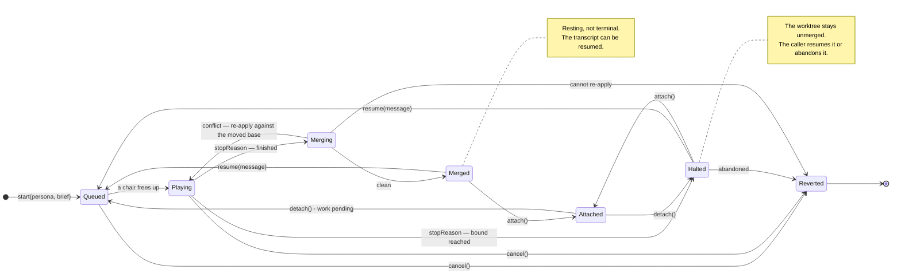

# Part lifecycle

One state machine per part. `stopReason` decides which end `Playing` reaches.
Companion to [README §3](../README.md#lifecycle).

```mermaid
stateDiagram-v2
  direction LR
  [*] --> Queued: start(persona, brief)
  Queued --> Playing: a chair frees up
  Queued --> Reverted: cancel()
  Playing --> Merging: stopReason — finished
  Playing --> Halted: stopReason — bound reached
  Playing --> Reverted: cancel()
  Halted --> Queued: resume(message)
  Halted --> Attached: attach()
  Halted --> Reverted: abandoned
  Attached --> Halted: detach()
  Attached --> Queued: detach() · work pending
  Merged --> Queued: resume(message)
  Merged --> Attached: attach()
  Merging --> Merged: clean
  Merging --> Playing: conflict — re-apply against the moved base
  Merging --> Reverted: cannot re-apply
  Reverted --> [*]

  note right of Halted
    The worktree stays unmerged.
    The caller resumes it or abandons it.
  end note

  note right of Merged
    Resting, not terminal.
    The transcript can be resumed.
  end note
```
