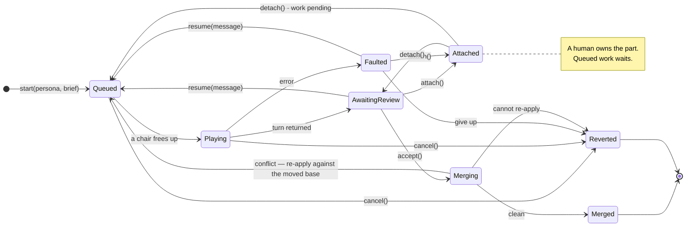

# Part lifecycle

One state machine per part. Companion to [README §3](../README.md#lifecycle).

```mermaid
stateDiagram-v2
  direction LR
  [*] --> Queued: start(persona, brief)
  Queued --> Playing: a chair frees up
  Queued --> Reverted: cancel()
  Playing --> AwaitingReview: turn returned
  Playing --> Faulted: error
  Playing --> Reverted: cancel()
  AwaitingReview --> Queued: resume(message)
  AwaitingReview --> Merging: accept()
  AwaitingReview --> Attached: attach()
  Faulted --> Attached: attach()
  Faulted --> Queued: resume(message)
  Faulted --> Reverted: give up
  Attached --> AwaitingReview: detach()
  Attached --> Queued: detach() · work pending
  Merging --> Merged: clean
  Merging --> Queued: conflict — re-apply against the moved base
  Merging --> Reverted: cannot re-apply
  Merged --> [*]
  Reverted --> [*]

  note right of Attached
    A human owns the part.
    Queued work waits.
  end note
```
