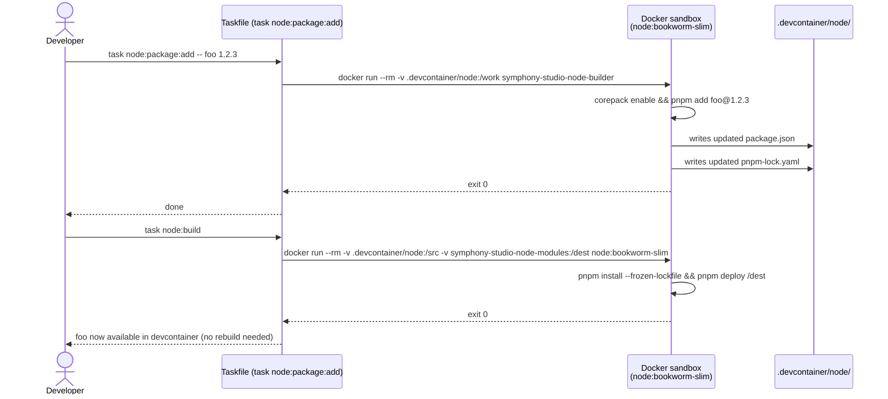
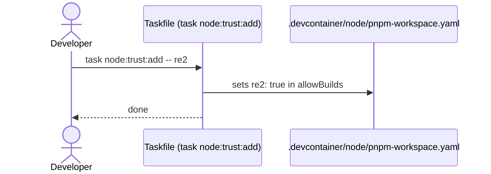
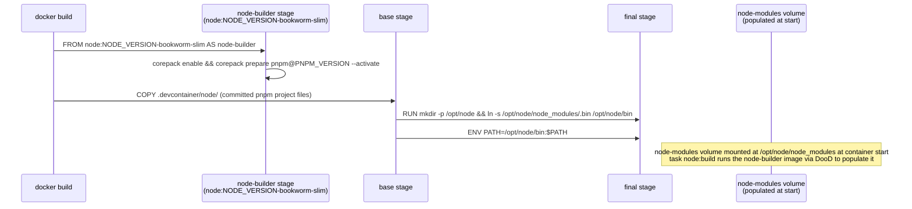
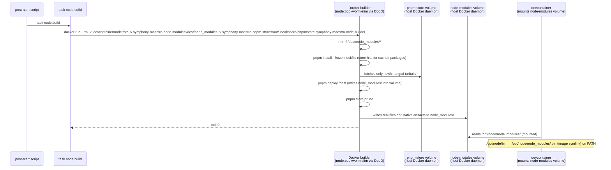

## Context

The devcontainer previously used `node-linker=hoisted` in a pnpm project generated inline in the Dockerfile. This approach was adopted to work around pnpm's default virtual store (symlinks back to the content store) breaking across Docker `COPY --from` stages. It resulted in:

- Native module build artifacts (re2) not being copied to the hoisted location, causing `MODULE_NOT_FOUND` at runtime in the final image
- No lockfile — package resolution happened at image build time with no content-hash verification
- Build script approvals managed ad-hoc via `pnpm approve-builds` mid-build rather than as a committed, reviewed artifact
- opencode-ai's postinstall invoked manually with `node postinstall.mjs`, bypassing pnpm's security model entirely

The correct tools exist in pnpm to solve all of these properly.

## Goals / Non-Goals

**Goals:**
- Reproducible npm package installs via committed `pnpm-lock.yaml` with content hashes
- `pnpm deploy` to produce a portable, symlink-free node_modules that survives `COPY --from`
- Explicit, version-controlled build script approval in committed `pnpm-workspace.yaml`
- Supply chain hardening: minimum release age (7 days), exotic dep blocking, trust policy
- All three tools (openspec, opencode-ai, renovate including re2) installed via pnpm and working in the final image
- Node and pnpm versions pinned in the Dockerfile alongside all other tool versions; builder image built from the same Dockerfile as the devcontainer
- A `task devcontainer:update-lockfile` task for regenerating the lockfile without pnpm in the devcontainer

**Non-Goals:**
- Installing pnpm in the final devcontainer image
- Supporting npm or yarn as alternatives
- Managing non-npm tools (go, deno, task) via pnpm
- Deciding whether to replace opencode or renovate with non-npm distributions (separate change if warranted)

## Decisions

### D1: Committed pnpm project files instead of inline generation

**Decision**: `.devcontainer/node/package.json`, `pnpm-lock.yaml`, and `pnpm-workspace.yaml` are committed to the repo. `package.json` starts with empty `dependencies`; `pnpm-workspace.yaml` starts with empty `allowBuilds: []`. Packages and trust entries are added via `task node:package:add` and `task node:trust:add` respectively, which update the committed files.

**Rationale**: Inline `printf`-generated `package.json` cannot have a lockfile. Without a lockfile, every image build resolves transitive deps from the network with no content verification. Committed files make dep changes visible in code review (like `go.sum` or `Cargo.lock`).

**Alternative considered**: Keep inline generation, accept no lockfile. Rejected: no reproducibility guarantee, no content hash verification.

### D2: Named Docker volume for node_modules, installed via pnpm modulesDir

**Decision**: node_modules is NOT installed at Docker build time. A named Docker volume `node-modules` is declared in `docker-compose.yml` and mounted at `/opt/node_modules` on the `symphony-studio` service. `pnpm-workspace.yaml` sets `modulesDir: "/opt/node_modules"` so pnpm installs packages directly into the volume — no `pnpm deploy`, no wipe step.

`task node:build` runs the `symphony-studio-node-builder` image via DooD with `.devcontainer/node/` bind-mounted RW (so pnpm can write the workspace state file) and the volume mounted at `/opt/node_modules`. It runs `pnpm install --frozen-lockfile`, which reads `allowBuilds` from the committed `pnpm-workspace.yaml` and installs packages directly into the volume.

The Dockerfile bakes `ENV PATH=/opt/node_modules/.bin:$PATH` into the devcontainer image. The path is stable because the volume is always mounted at `/opt/node_modules`.

**Rationale**: `modulesDir` redirects pnpm's install target without needing `pnpm deploy` or `injectWorkspacePackages`. This avoids all the side effects of the deploy approach (workspace state written back to source dir, pnpm-store leakage). The only artifact written to `.devcontainer/node/` is `node_modules/.pnpm-workspace-state.json` — the pnpm workspace state cache, which is gitignored and useful for incremental installs.

**Key assumption**: Named volumes live on the host Docker daemon. Both the builder containers (spawned via `task node:*`) and the devcontainer (mounted via `docker-compose.yml`) share the same host daemon, so they see the same volume.

**Alternative considered**: `pnpm deploy` to volume. Rejected: `injectWorkspacePackages: true` required by pnpm v10 deploy causes pnpm-store and workspace state to leak back into the source bind-mount. `modulesDir` achieves the same result cleanly.

### D3: All three tools installed via pnpm

**Decision**: openspec, opencode-ai, and renovate (with re2 as a direct dep if needed) are all installed via `pnpm install --frozen-lockfile` into the named volume via `modulesDir`.

**Rationale**: `pnpm install` with `modulesDir` pointing at the named volume is sufficient — no deploy step needed. Build script trust is controlled via `allowBuilds` in the committed `pnpm-workspace.yaml`.

### D4: pnpm-workspace.yaml as supply chain control file

**Decision**: `pnpm-workspace.yaml` is the single location for all pnpm supply chain settings: `allowBuilds`, `minimumReleaseAge`, `blockExoticSubdeps`, `trustPolicy`.

**Rationale**: All settings are committed and reviewable. `minimumReleaseAge: 10080` (7 days in minutes) means newly published packages cannot be resolved until a week has passed — the window when supply chain attacks are most likely to be active.

### D5: Sandboxed package management via node:package:* and node:trust:* tasks

**Decision**: Package and trust management are exposed as Task tasks (`node:package:add`, `node:package:rm`, `node:package:update`, `node:package:list`, `node:package:audit`, `node:package:prune`, `node:trust:add`, `node:trust:rm`, `node:trust:list`, `node:trust:verify`). Mutating tasks run pnpm in a throwaway Docker container via DooD, bind-mounting only `.devcontainer/node/`. `node:package:prune` additionally mounts the `${localWorkspaceFolderBasename}-pnpm-store` volume to run `pnpm store prune`, removing unreferenced store entries after a package removal. It may also be chained from `node:package:rm` or called independently.

**Rationale**: Keeps pnpm out of the devcontainer. The task interface exposes intent rather than mechanism — the user never needs to know about lockfiles or pnpm commands. Trust is managed independently of package installation because transitive deps (e.g. re2) need build script approval without being direct deps.

### D6: node-builder as a docker-compose service; pnpm version owned by package.json

**Decision**: The Dockerfile contains a `node-builder` stage using `node:${NODE_VERSION}-bookworm-slim` with `corepack enable`. No `PNPM_VERSION` ARG — corepack reads the `packageManager` field from `.devcontainer/node/package.json` at task runtime to select the correct pnpm version. This stage is exposed as a `node-builder` service in `docker-compose.yml` with no profile. The service has `command: "true"` so it exits cleanly if run directly by mistake. The image is tagged `symphony-studio-node-builder`.

**Rationale**: Removing `PNPM_VERSION` from the Dockerfile ARG block eliminates dual ownership. The pnpm version is declared once in `package.json`'s `packageManager` field alongside the packages that depend on it. Corepack enforces the pinned version at runtime without needing it baked into the image.

## Risks / Trade-offs

- **Lockfile must be regenerated via task on dep changes** → Mitigated by `task node:package:*` interface; pnpm never needed in devcontainer
- **re2 native module must be in pnpm deploy output** → To be confirmed at MVP verification (task 4); if `pnpm deploy` does not include native build artifacts, re2 must be added as an explicit direct dep
- **pnpm deploy output path for wrapper script find commands** → Needs verification; deploy output structure may differ from hoisted layout

## Workflows

### Installing a new npm package (e.g. adding `foo@1.2.3`)

### Trusting a transitive dep's build script (e.g. re2)

### Building the devcontainer image

### Container start (first time or after package changes)

## Open Questions

- Does `pnpm deploy` include native module build artifacts (`.node` files from install scripts)? This determines whether re2 works without being an explicit direct dep.
- Does `pnpm deploy` include the opencode-ai ELF binary produced by its postinstall script?

## Implementation Notes

### First attempt — abandoned at MVP verification

The first implementation attempt worked through a long chain of pnpm/corepack issues before being abandoned:

- `pnpm deploy` in v10 requires `injectWorkspacePackages: true` in `pnpm-workspace.yaml` (without it, `ERR_PNPM_DEPLOY_NONINJECTED_WORKSPACE`). This in turn causes pnpm to write a `node_modules/` directory to the source bind-mount (`/src`) as a workspace state marker — even with `--modules-dir` redirected to `/tmp`. The directory only contains `.pnpm-workspace-state.json`; it is harmless but unavoidable.
- `pnpm install` also restores the `.pnpm-store` into the source directory. With `TMPDIR` redirected and `--store-dir /tmp/pnpm-store`, the store still re-appeared in `/src` on a successful build with `opencode-ai` added as a dependency. Root cause was not fully diagnosed before deciding to refactor.
- `corepack` (invoked via the `packageManager` field in `package.json`) writes a cache into the source directory during container startup, not just during `corepack prepare`.
- The `pnpm-store` named volume was removed from `docker-compose.yml` during iteration (the store is ephemeral per-build in `/tmp`); this turned out to be correct.
- The `node-modules` volume is mounted at `/opt/node` (not `/opt/node/node_modules`) — deploy target is `/opt/node/node_modules` (a subdirectory pnpm creates).

**Conclusion**: The `injectWorkspacePackages` + `pnpm deploy` path has too many side effects on the source directory for a DooD bind-mount setup. The refactor will use a different approach.
