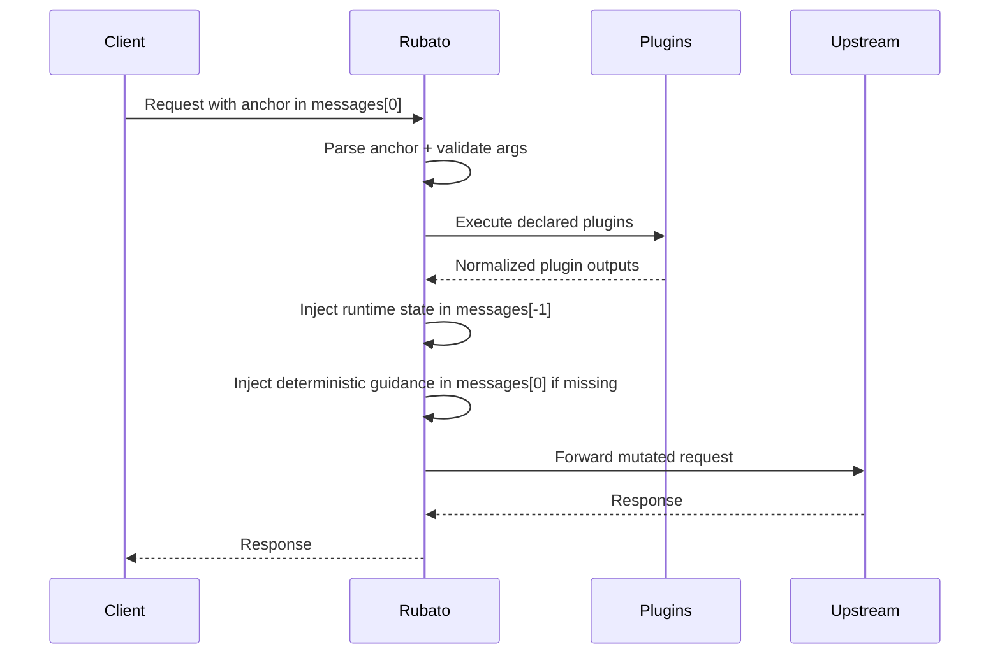

## Context

This change delivers staged behavior increment: from pure transport to contract-driven runtime context injection.

## Goals / Non-Goals

**Goals**
- Parse anchor declarations in `messages[0]`.
- Execute only declared plugins with per-plugin args.
- Inject runtime state into `messages[-1]`.
- Inject deterministic guidance into `messages[0]` when missing.
- Ship `git_status` as the single MVP plugin.

**Non-Goals**
- No large observability/polish redesign.
- No speculative extra plugins.
- No session state or memoization.

## Decisions

### 1) Strict anchor parsing with deterministic failures

Malformed anchor content is a request failure, not silent bypass.

Rationale:
- Prevents ambiguous behavior and hidden partial states.

### 2) Declared-plugin execution only

Only plugin keys declared by the anchor are executed. Unknown keys fail fast.

Rationale:
- Request-local explicitness and predictable blast radius.

### 3) Stateless per-request refresh

Plugin outputs are recomputed on every eligible request; no per-session cache reuse.

Rationale:
- Ensures runtime-state reflects current repo state.

### 4) Deterministic guidance rendering in `messages[0]`

Guidance block rendering is canonical: stable plugin ordering, stable arg ordering, version token, no volatile fields.

Rationale:
- Cache-stability requirement demands byte-identical guidance for equivalent anchors.

### 5) `git_status` output includes edge states as visible state

Detached HEAD and bare repository states are represented in plugin output, not treated as intrinsic plugin failures.

Rationale:
- Model needs explicit repository state visibility for correct reasoning.

### 6) Runtime behavior is topology-agnostic

Anchor parsing, plugin execution, and mutation semantics are defined independent of docker-compose or any specific sidecar topology.

Rationale:
- Preserves contract portability across devcontainer and non-compose deployments.
- Keeps issue #60 as supporting infrastructure rather than a hard behavioral prerequisite.

## Risks / Trade-offs

- Fail-fast behavior may interrupt requests when plugin environment is unhealthy; accepted for correctness.
- Guidance mutation in `messages[0]` introduces cache-sensitivity; mitigated by deterministic canonical template.

## Sequence Workflow

