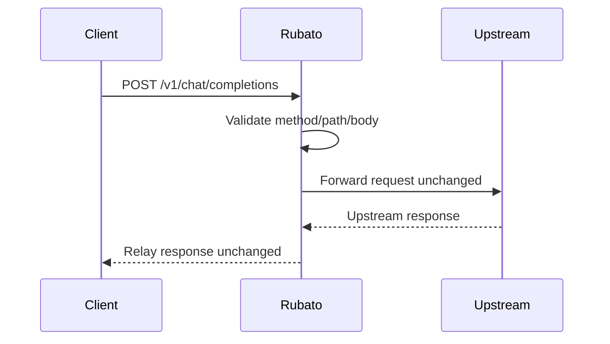

## Context

This change isolates infrastructure from behavior. Rubato must first exist as a cleanly structured, testable Go service before adding anchor parsing and plugin-driven mutation.

## Goals / Non-Goals

**Goals**
- Establish Rubato as a maintainable Go project in this repository.
- Adopt standard project layout with `cmd/`, `internal/`, `pkg/`, and `test/` directories.
- Provide a minimal pass-through proxy for chat-completions traffic.
- Enforce stable baseline error handling and test coverage.

**Non-Goals**
- No runtime-state injection.
- No plugin contract.
- No mutation of `messages[0]` or `messages[-1]`.
- No cache guidance behavior.

## Decisions

### 1) Go project layout is explicit from day one

Rubato is organized under module root `rubato/` with:
- `cmd/rubato`: executable entrypoint
- `internal/`: request pipeline, transport, and handler internals
- `pkg/`: externally reusable types/helpers only when needed
- `test/`: integration-style tests and fixtures

Rationale:
- Avoids spike-era single-file drift.
- Keeps boundaries clear before behavior complexity grows.

### 2) Minimal proxy behavior is strict pass-through

For eligible chat-completions requests, Rubato forwards request/response without prompt mutation.

Rationale:
- Baseline observability and transport correctness must be proven independently of injection semantics.

### 3) Baseline error model is deterministic

Rubato returns deterministic 4xx/5xx shapes for:
- malformed client request body
- unsupported method/path
- upstream transport failure

Rationale:
- Provides stable contracts for plugin-stage tests and operational debugging.

### 4) Testing is part of foundation, not follow-on

This change includes unit and component tests for routing, request parsing, and pass-through forwarding.

Rationale:
- Follow-on changes should extend an existing safety net.

## Risks / Trade-offs

- Adds up-front engineering work before visible feature behavior; accepted to reduce long-term rework.
- Establishing layout now may require small follow-on refactors; accepted because package boundaries are intentionally conservative.

## Sequence Workflow

