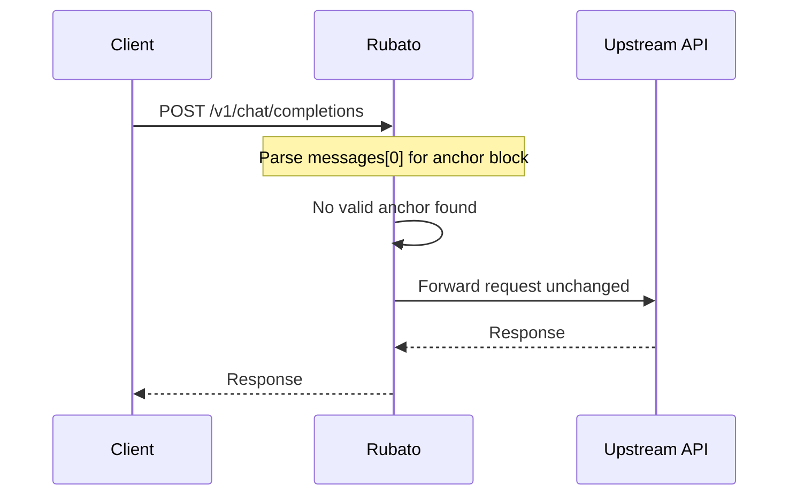
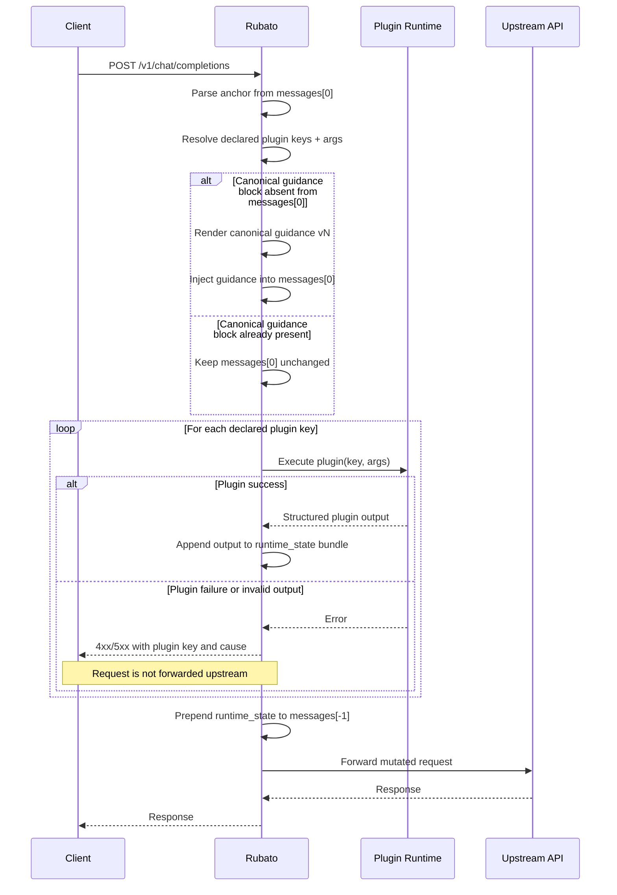
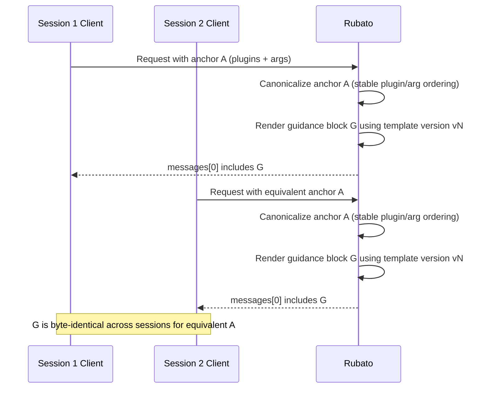

## Context

This change defines a durable runtime-injection architecture for rubato, an OpenRouter-compatible request router that can enrich AI requests with current repository state. The design is intentionally independent of any specific prototype or prior implementation so it remains valid if existing exploratory code is removed.

The immediate need is to enrich AI turns with current repository state without requiring manual prompt edits, while preserving statelessness and keeping runtime behavior safe, deterministic, and observable.

Delivery sequencing:
- Stage A: minimal non-mutating runtime behavior.
- Stage B: MVP plugin-based injection behavior.
- Task 7 contract-freeze work.
- Stage C: refinement and polish.

## Goals / Non-Goals

**Goals:**
- Define a marker/anchor format in `messages[0]` that is human-readable and machine-parseable, and controls which injection plugins run for a given request.
- Support static per-plugin arguments in the anchor so each plugin can customize behavior without out-of-band config.
- Inject runtime plugin output into `messages[-1]` while keeping `messages[0]` mostly stable except for idempotent plugin guidance augmentation.
- Inject plugin-presence usage guidance into `messages[0]` using deterministic content checks so cache-relevant content is stable.
- Start with a git-status-focused MVP plugin while designing a plugin contract that supports additional plugins without redesign.
- Enforce fail-fast behavior for declared plugin execution failures.
- Keep runtime stateless by refreshing plugin outputs on each request.

**Non-Goals:**
- Defining final textual formatting for injected git output as a strict requirement.
- Implementing all future plugins (unit tests, BDD status, etc.) in this first change.
- Designing a distributed multi-container architecture as a requirement for MVP.
- Requiring transparent MITM proxying via generic environment interception.

## Decisions

### 1) Anchor-controlled plugin selection in `messages[0]`
Rubato parses an explicit anchor block from `messages[0].content` and executes only the declared plugin keys.

Rationale:
- Keeps control close to agent/system intent.
- Allows per-session or per-agent plugin variance without daemon reconfiguration.
- Preserves human legibility for debugging and prompt review.

Alternatives considered:
- Global static plugin list in daemon config: rejected because it cannot vary per agent/session.
- Hidden metadata outside prompt: rejected because it is less legible and harder to inspect in captured requests.

### 2) Dual mutation model: runtime state in `messages[-1]`, cache-stable plugin guidance in `messages[0]`
Rubato prepends runtime state to the last user message and may also augment `messages[0]` with a compact plugin guidance block when not already present.

Rationale:
- Keeps dynamic state near user turn context (`messages[-1]`) while allowing one-time declarative guidance in `messages[0]`.
- Uses idempotent, content-driven augmentation to avoid repetitive prompt growth across repeated calls.
- Uses deterministic canonical rendering so the same anchor/plugin declaration yields the same `messages[0]` guidance across sessions, preserving upstream cache behavior.

Alternative considered:
- Mutating only `messages[-1]` and never `messages[0]`: rejected because plugin presence/usage instructions would need to be repeated externally or manually.

### 7) Deterministic guidance rendering for cache stability
The plugin-guidance augmentation in `messages[0]` is rendered via a canonical deterministic template and ordering.

Rationale:
- Prevents cache misses caused by semantically equivalent but textually different guidance blocks.
- Makes behavior testable with byte-for-byte comparisons.

Required rendering constraints:
- Stable plugin ordering (for example lexicographic by plugin key).
- Stable argument key ordering in rendered guidance.
- No volatile values (timestamps, random IDs, host-specific paths, run counters).
- Versioned guidance header/token so future format changes are explicit and migratable.

### 3) Fail-fast plugin execution for declared keys
If a declared plugin cannot execute or returns invalid output, rubato fails the request with a clear error payload.

Rationale:
- Prevents silent drift between expected and actual context.
- Makes plugin reliability visible early.

Alternative considered:
- Best-effort partial injection with warnings: rejected for MVP because hidden partial state can mislead model behavior.

### 4) Stateless per-request refresh
Rubato recomputes declared plugin outputs on every eligible request.

Rationale:
- Guarantees current workspace state.
- Avoids complex session tracking and cache invalidation logic.

Alternative considered:
- Per-session memoization and change-only injection: deferred due to complexity and conflict with strict statelessness objective.

### 5) Plugin contract with discovery-ready architecture
MVP includes one built-in `git_status` plugin but defines a plugin API that can support multiple plugins later. Physical plugin declaration/storage mechanism is intentionally implementation-flexible in this design phase.

Rationale:
- Meets current scope while avoiding premature lock-in on file/task integration details.
- Enables later expansion without changing anchor semantics.

Alternatives considered:
- Commit now to YAML-only or Taskfile-only plugin definitions: deferred until implementation validation clarifies operational ergonomics.

### 6) Anchor supports plugin arguments
Each plugin declaration in the anchor may include static arguments that are passed to that plugin during execution.

Rationale:
- Allows controlled variability per plugin without global daemon-level setting churn.
- Keeps behavior discoverable in a single prompt artifact.

Alternatives considered:
- Global shared plugin argument config only: rejected because it is too coarse for mixed-agent and mixed-session use.

## Sequence Workflows

### A) Request without anchor (pass-through)

### B) Request with anchor (inject + fail-fast)

### C) Cross-session cache stability for messages[0] guidance

## Risks / Trade-offs

- [Anchor grammar ambiguity] -> Mitigation: define a strict anchor grammar with deterministic parse failures and explicit error messages.
- [Fail-fast may interrupt workflows] -> Mitigation: error responses include plugin key and failure cause; operators can remove broken plugin keys from anchor quickly.
- [Per-request command cost] -> Mitigation: keep MVP plugin set minimal and command execution bounded with timeouts.
- [Prompt growth due to injected state] -> Mitigation: plugin outputs are summarized and bounded; do not require verbose/raw output by default.
- [Cache churn from unstable guidance text] -> Mitigation: deterministic canonical guidance template with stable ordering and no volatile fields.
- [Deployment topology changes over time] -> Mitigation: keep execution interface abstract so plugin execution may run in-process or delegated runner without changing spec behavior.
